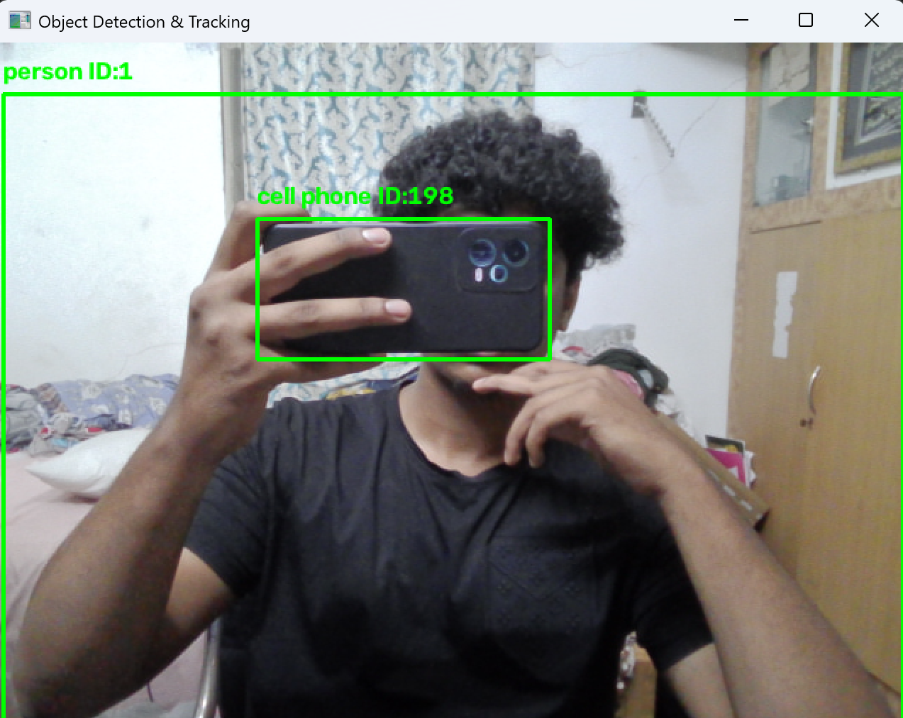

# Task 4: Object Detection and Tracking

This project detects objects in real time (webcam or video file) and tracks
them across frames, assigning each object a persistent ID.

## How it works (matches each requirement)

| Requirement | How it's done |
|---|---|
| Real-time video input | `cv2.VideoCapture(0)` for webcam, or a filename for a video file |
| Pre-trained detection model | YOLOv8 (`yolov8n.pt`), auto-downloaded by `ultralytics` |
| Process each frame + draw boxes | `model(frame)` runs detection every loop iteration |
| Object tracking | Deep SORT (`deep-sort-realtime`) links detections across frames |
| Display labels + IDs live | `cv2.imshow` window shows class name + track ID on each box |

## 1. Install dependencies

You need Python 3.8+ installed. Then, in a terminal:

```bash
pip install -r requirements.txt
```

This installs:
- `ultralytics` → YOLOv8 (the detection model)
- `deep-sort-realtime` → the Deep SORT tracker
- `opencv-python` → for video capture/display

## 2. Run it

**Using your webcam** (default — no changes needed):
```bash
python object_detection_tracking.py
```

**Using a video file instead**, open `object_detection_tracking.py` and change
the last line:
```python
main(video_source="your_video.mp4")
```

## 3. What you'll see

A window opens showing your video feed with a green box around every
detected object, labeled with its class (e.g. "person", "car") and a
tracking ID (e.g. "ID:3") that stays the same as long as the object stays
in view. Press `q` to quit.

## Notes for your assignment writeup

- **YOLOv8** was chosen over Faster R-CNN because it's much faster
  (important for real-time video) while still being highly accurate — a
  common tradeoff to mention if your task asks you to justify the choice.
- **Deep SORT** improves on plain SORT by using an appearance embedding
  (not just position/motion) to re-identify objects after brief
  occlusion, which is why IDs are more stable when objects cross paths.
- If you don't have a GPU, YOLOv8-nano (`yolov8n.pt`) still runs at a
  usable frame rate on CPU. For better accuracy (at the cost of speed)
  you can swap in `yolov8s.pt` or `yolov8m.pt`.
- First run will be slower since it downloads the model weights.

## Troubleshooting

- **Webcam doesn't open**: try `video_source=1` (some laptops have
  multiple camera indices), or check another app isn't already using it.
- **Very slow / low FPS**: use `yolov8n.pt` (already the default) and
  make sure you're not accidentally running on a huge video resolution.
- **`ModuleNotFoundError`**: re-run `pip install -r requirements.txt`
  inside the same Python environment you're running the script from.
